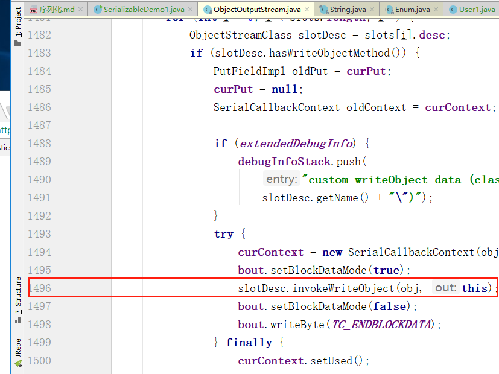

## 应用场景
##### 1、用户登陆session  将用户对象保存在session中
```
1.一般来说，服务器启动后，就不会再关闭了，但是如果逼不得已需要重启，而用户会话还在进行相应的操作，这时就需要使用序列化将session信息保存起来放在硬盘，服务器重启后，又重新加载。这样就保证了用户信息不会丢失，实现永久化保存
2.淘宝每年都会有定时抢购的活动，很多用户会提前登录等待，长时间不进行操作，一致保存在内存中，而到达指定时刻，几十万用户并发访问，就可能会有几十万个session，内存可能吃不消，这时就需要进行对象的活化、钝化，让其在闲置的时候离开内存，将信息保存至硬盘，等要用的时候，就重新加载进内存
```
##### 2、redis缓存对象数据，序列化、反序列化处理
##### 3、在Java中，对象的序列化与反序列化被广泛应用到RMI(远程方法调用)及网络传输中
[参考资料](https://mp.weixin.qq.com/s?__biz=MzI3NzE0NjcwMg==&mid=2650120836&idx=1&sn=c83a980c0871faf607ae613092c69760&chksm=f36bbfa5c41c36b317c103f27b9d99c26aecba52e4bf614bd73dcadc1e4bc5ab8f99fb082eba&scene=21#wechat_redirect)
## 序列化
将对象的状态信息转换为可以存储或传输的形式的过程一般将一个对象存储至一个储存媒介，例如档案或是记亿体缓冲等。在网络传输过程中，可以是字节或是XML等格式。
## 反序列化
字节的或XML编码格式可以还原完全相等的对象。
## 相关接口
##### 1、Serializable 接口，仅用于标识类可序列化
```
1、未实现此接口的类将无法使其任何状态序列化或反序列化。可序列化类的所有子类型本身都是可序列化的
2、主要是因为序列化在真正的执行过程中会使用instanceof判断一个类是否实现类Serializable，如果未实现则直接抛出异常
3、如果要序列化的类有父类，要想同时将在父类中定义过的变量持久化下来，那么父类也应该继承java.io.Serializable接口
```
```
//序列化对象
try(FileOutputStream fos = new FileOutputStream("E:\\data\\user.txt");
            ObjectOutputStream oos = new ObjectOutputStream(fos)){
            oos.writeObject(user);
        }catch (Exception e){
        }
```
```
//反序列化对象
try(ObjectInputStream ois = new ObjectInputStream(new
                FileInputStream("E:\\data\\user.txt"))){
            User userBack = (User)ois.readObject();
            System.out.println(userBack);
        }catch (Exception e){}
```
##### 2、Externalizable 继承了Serializable,定义了两个抽象方法：writeExternal()与readExternal()，开发人员可以自定义序列化和反序列化规则
```
在使用Externalizable进行序列化的时候，在读取对象时，会调用被序列化类的无参构造器去创建一个新的对象，然后再将被保存对象的字段的值分别填充到新对象中。
所以，实现Externalizable接口的类必须要提供一个public的无参的构造器
```
```
//方法实现
@Override
    public void writeExternal(ObjectOutput out) throws IOException {
        out.writeObject(name);
        out.writeInt(age);
    }

    @Override
    public void readExternal(ObjectInput in) throws IOException, ClassNotFoundException {
        name = (String)in.readObject();
        age = in.readInt();
    }
```
##### 3、实现接口Serializable的类，也可自定义序列化和反序列化策略
```
 private void writeObject(java.io.ObjectOutputStream s)
            throws java.io.IOException{
        s.writeObject(address);
    }
    private void readObject(java.io.ObjectInputStream s)
            throws java.io.IOException, ClassNotFoundException {
       address = (String)s.readObject();
    }
```
问题：
```
[参考资料](https://mp.weixin.qq.com/s?__biz=MzI3NzE0NjcwMg==&mid=2650120882&idx=1&sn=8e355b5ee3cce0a2d0108edbdf88e606&chksm=f36bbf93c41c3685340d4f658dddec6bcbd5903b5d92875bb06d51a0dfc49ee7326417a0edff&scene=21#wechat_redirect)
1、ArrayList中就采用raedObject和writeObject方法，定义了elementData的序列化及反序列化策略，其中elementData由transient修饰
2、为什么ArrayList要用这种方式来实现序列化呢？ArrayList实际上是动态数组，每次在放满以后自动增长设定的长度值，如果数组自动增长长度设为100，而实际只放了一个元素，那就会序列化99个null元素。为了保证在序列化的时候不会将这么多null同时进行序列化，ArrayList把元素数组设置为transient
3、如果一个类中包含writeObject 和 readObject 方法，那么这两个方法是怎么被调用的? 在使用ObjectOutputStream的writeObject方法和ObjectInputStream的readObject方法时，会通过反射的方式调用
```


## transient 关键字
关键字的作用是控制变量的序列化，在变量声明前加上该关键字，可以阻止该变量被序列化到文件中，在被反序列化后，transient 变量的值被设为初始值，如 int 型的是 0，对象型的是 null
## 序列化并不保存静态变量
## 虚拟机是否允许反序列化  serialVersionUID
不仅取决于类路径和功能代码是否一致，一个非常重要的一点是两个类的序列化 ID 是否一致（就是 private static final long serialVersionUID)
```
在进行反序列化时，JVM会把传来的字节流中的serialVersionUID与本地相应实体类的serialVersionUID进行比较，
如果相同就认为是一致的，可以进行反序列化，否则就会出现序列化版本不一致的异常，即是InvalidCastException
```
##  在序列化类中未明确定义serialVersionUID，系统自动添加一个ID(类名、属性、方法灯等信息相关)。修改了类得相关属性信息会导致ID值变化，在反序列过程中会比较字节流中ID和当前ID,不一致则反序列失败
```
serialVersionUID  验证版本一致性
1、serialVersionUID是用来验证版本一致性的。所以在做兼容性升级的时候，不要改变类中serialVersionUID的值。
```