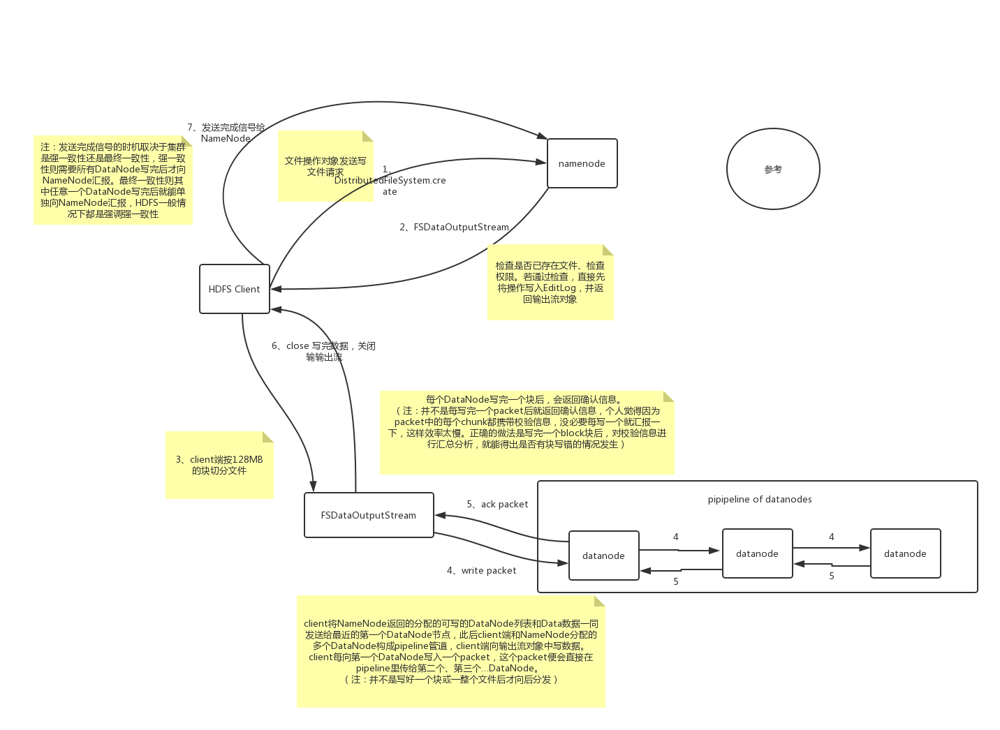
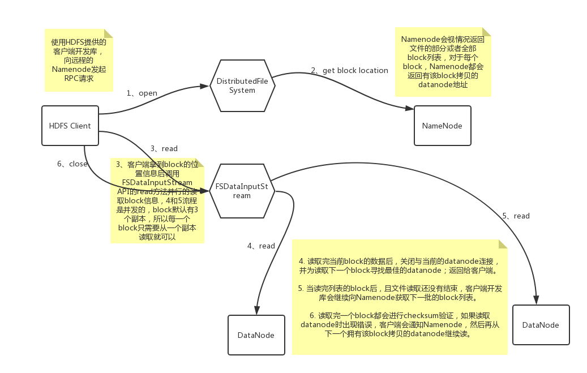

[参考资料](https://blog.csdn.net/wypersist/article/details/79797565)

## 写数据流程



~~~
1. 使用HDFS提供的客户端开发库，向远程的Namenode发起RPC请求；

2. Namenode会检查要创建的文件是否已经存在，创建者是否有权限进行操作，成功则会为文件创建一个记录，否则会让客户端抛出异常；

3. 当客户端开始写入文件的时候，开发库会将文件切分成多个packets（信息包），并在内部以"data queue"的形式管理这些packets，并向Namenode申请新的blocks，获取用来存储replicas（复制品）的合适的datanodes列表，列表的大小根据在Namenode中对replication的设置而定。

4. 开始以pipeline（管道）的形式将packet写入所有的replicas中。开发库把packet以流的方式写入第一个datanode，该datanode把该packet存储之后，再将其传递给在此pipeline（管道）中的下一个datanode，直到最后一个datanode，这种写数据的方式呈流水线的形式。

5. 最后一个datanode成功存储之后会返回一个ack packet，在pipeline里传递至客户端，在客户端的开发库内部维护着"ack queue"，成功收到datanode返回的ack packet后会从"ack queue"移除相应的packet。

6. 如果传输过程中，有某个datanode出现了故障，那么当前的pipeline会被关闭，出现故障的datanode会从当前的pipeline中移除，剩余的block会继续剩下的datanode中继续以pipeline的形式传输，同时Namenode会分配一个新的datanode，保持replicas设定的数量。

~~~
## 一个datanode突然坏掉了怎么办
~~~
1. 如果传输过程中，有某个datanode出现了故障，那么当前的pipeline会被关闭，出现故障的datanode会从当前的pipeline中移除，剩余的block会继续剩下的datanode中继续以pipeline的形式传输，同时Namenode会分配一个新的datanode，保持replicas设定的数量。

2. 关闭pipeline，将ack queue中的数据块放入data queue的开始。

3. 当前的数据块在已经写入的数据节点中被元数据节点赋予新的标示，则错误节点重启后能够察觉其数据块是过时的，会被删除。

4. 失败的数据节点从pipeline中移除，另外的数据块则写入pipeline中的另外两个数据节点。

5. 元数据节点则被通知此数据块是复制块数不足，将来会再创建第三份备份。

6. 客户端调用create()来创建文件

7. DistributedFileSystem用RPC调用元数据节点，在文件系统的命名空间中创建一个新的文件。

8. 元数据节点首先确定文件原来不存在，并且客户端有创建文件的权限，然后创建新文件。

9. DistributedFileSystem返回DFSOutputStream，客户端用于写数据。

10. 客户端开始写入数据，DFSOutputStream将数据分成块，写入data queue。

11. Data queue由Data Streamer读取，并通知元数据节点分配数据节点，用来存储数据块(每块默认复制3块)。分配的数据节点放在一个pipeline里。

12. Data Streamer将数据块写入pipeline中的第一个数据节点。第一个数据节点将数据块发送给第二个数据节点。第二个数据节点将数据发送给第三个数据节点。

13. DFSOutputStream为发出去的数据块保存了ack queue，等待pipeline中的数据节点告知数据已经写入成功。
~~~
## 读数据流程


~~~
1. 首先调用FileSystem对象的open方法，其实获取的是一个DistributedFileSystem的实例。

2. DistributedFileSystem通过RPC(远程过程调用)获得文件的第一批block的locations，同一block按照重复数会返回多个locations，这些locations按照hadoop拓扑结构排序，距离客户端近的排在前面。

3. 前两步会返回一个FSDataInputStream对象，该对象会被封装成DFSInputStream对象，DFSInputStream可以方便的管理datanode和namenode数据流。客户端调用read方法，DFSInputStream就会找出离客户端最近的datanode并连接datanode。

4. 数据从datanode源源不断的流向客户端。

5. 如果第一个block块的数据读完了，就会关闭指向第一个block块的datanode连接，接着读取下一个block块。这些操作对客户端来说是透明的，从客户端的角度来看只是读一个持续不断的流。

6. 如果第一批block都读完了，DFSInputStream就会去namenode拿下一批blocks的location，然后继续读，如果所有的block块都读完，这时就会关闭掉所有的流。
~~~

```
　   首先，客户端通过调用FileSystem对象中的open()函数来读取它所需的数据。FileSystem是HDFS中DistributedFileSystem的一个实例。DistributedFileSystem会通过RPC协议调用NameNode来确定请求文件块所在的位置。这里需要注意的是，NameNode只会返回所调用文件中开始的几个块而不是全部返回。对于每个返回的块，都包含块所在的DataNode地址。随后，这些
返回的DataNode会按照Hadoop定义的集群拓扑结构得出客户端的距离，然后再进行排序。如果客户端本身就是一个DataNode，那么它将从本地读取文件。
    其次，DistributedFileSystem会向客户端返回一个支持文件定位的输入流对象FSDataInputStream，用于给客户端读取数据。FSDataInputStream包含一个DFSInputStream对象，这个对象用来管理DataNode和NameNade之间的I/o。
    当以上步骤完成时，客户端便会在这个输入流之上调用read()函数。DF SInputStream对象中包含文件开始部分的数据块所在的DataNode地址,首先它会连接包含文件第一个块最近DataNode 。随后，在数据流中重复调用read()函数，直到这个块全部读完为止。当最后一个块读取完毕时，DFSInputStream会关闭连接，并查找存储下一个数据块距离客户端最近的DataNode。以上这些
步骤对客户端来说都是透明的。
　　客户端按照DFSInputStream打开和DataNode连接返回的数据流的顺序读取该块，它也会调用NameNode来检索下一组块所在的DataNode的位置信息。当客户端完成所有文件的读取时，则会在FSDataInputStream中调用close()函数。
　　当然，HDFS会考虑在读取中节点出现故障的情况。目前HDFS是这样处理的：如果客户端和所连接的DataNode在读取时出现故障，那么它就会去尝试连接存储这个块的下一个最近的DataNode，同时它会记录这个节点的故障。这样它就不会再去尝试连接和读取块。客户端还会验证从DataNode传送过来的数据校验和。如果发现一个损坏的块.那么客户端将会再尝试从别的DataNode读取数据块，向NameNode报告这个信息，NameNode也会更新保存的文件信息。
    这里要关注的一个设计要点是，客户端通过NameNode引导获取最合适的DataNode地址，然后直接连接DataNode读取数据。这种设计的好处是，可以使HDFS扩展到更大规模的客户端并行处理，这是因为数据的流动是在所有DataNode之间分散进行的。同时NameNode的压力也变小了，使得NameNode只用提供请求块所在的位置信息就可以了，而不用通过它提供数据，这样就避免了NameNode随着客户端数量的增长而成为系统瓶颈
```

## 问题
#### 1. 读写过程，数据完整性如何保持
~~~
通过校验和。因为每个chunk中都有一个校验位，一个个chunk构成packet，一个个packet最终形成block，故可在block上求校验和。

HDFS 的client端即实现了对 HDFS 文件内容的校验和 (checksum) 检查。当客户端创建一个新的HDFS文件时候，分块后会计算这个文件每个数据块的校验和，此校验和会以一个隐藏文件形式保存在同一个 HDFS 命名空间下。当client端从HDFS中读取文件内容后，它会检查分块时候计算出的校验和（隐藏文件里）和读取到的文件块中校验和是否匹配，如果不匹配，客户端可以选择从其他 Datanode 获取该数据块的副本
~~~
